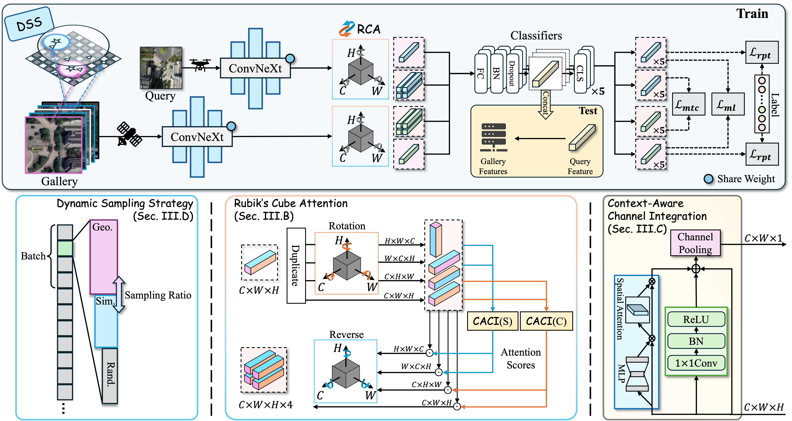

# CEUSP

<div align="center">

  <h3 align="center">Precise GPS-Denied UAV Self-Positioning via Context-Enhanced Cross-View Geo-Localization</h3>

</div>

<div align="center">
  Yuanze Xu<sup>1</sup>,&nbsp; Ming Dai<sup>1</sup>,&nbsp; Wenxiao Cai<sup>2</sup>,&nbsp; Wankou Yang<sup>1*</sup>

<sup>1</sup> Southeast University, <sup>2</sup> Stanford University.
\* Corresponding author.
</div>

<div align="center">
<a href="https://arxiv.org/abs/2502.11408"></a>
<a href="https://www.apache.org/licenses/LICENSE-2.0"></a>
<a href=""></a>
<a href=""></a>

</div>


## Abstract
  Image retrieval has been employed as a robust complementary technique to address the challenge of Unmanned Aerial Vehicles (UAVs) self-positioning.
  However, most existing methods primarily focus on localizing objects captured by UAVs through complex part-based representations, often overlooking the unique challenges associated with UAV self-positioning, such as fine-grained spatial discrimination requirements and dynamic scene variations.
  To address the above issues, we propose the Context-Enhanced method for precise UAV Self-Positioning (CEUSP), specifically designed for UAV self-positioning tasks.
  CEUSP integrates a Dynamic Sampling Strategy to efficiently select optimal negative samples, while the Rubik's Cube Attention module, combined with the Context-Aware Channel Integration module, enhances feature representation and discrimination by exploiting interdimensional interactions, inspired by the rotational mechanics of a Rubik's Cube.
  Extensive experimental validate the effectiveness of the proposed method, demonstrating notable improvements in feature representation and UAV self-positioning accuracy within complex urban environments.
  Our approach achieves state-of-the-art performance on the DenseUAV dataset, which is specifically designed for dense urban contexts, and also delivers competitive results on the widely recognized University-1652 benchmark.

<div align="center">



</div>

## Data Preparation
### Datasets

- To obtain the DenseUAV dataset, please fill out and submit the [request template](https://github.com/Dmmm1997/DenseUAV//blob/main/docs/Request.md) provided by the authors.
- To obtain the University-1652 dataset, please fill out and submit the [request template](https://github.com/layumi/University1652-Baseline/blob/master/Request.md) provided by the authors.

Once you have downloaded the datasets, please ensure they are placed in the appropriate directory.

### Data Structure
We recommend organizing the datasets in the following folder structure:

```text
├── University-1652/
│   ├── train/
│       ├── drone/                   /* drone-view training images 
│           ├── 0001
│           ├── 0002
│           ...
│       ├── street/                  /* street-view training images 
│       ├── satellite/               /* satellite-view training images       
│       ├── google/                  /* noisy street-view training images (collected from Google Image)
│   ├── test/
│       ├── query_drone/  
│       ├── gallery_drone/  
│       ├── query_street/  
│       ├── gallery_street/ 
│       ├── query_satellite/  
│       ├── gallery_satellite/ 
│       ├── 4K_drone/
├── DenseUAV/
│   ├── Dense_GPS_ALL.txt           /* format as: path latitude longitude height
│   ├── Dense_GPS_test.txt
│   ├── Dense_GPS_train.txt
│   ├── train/
│       ├── drone/                   /* drone-view training images
│           ├── 000001
│               ├── H100.JPG
│               ├── H90.JPG
│               ├── H80.JPG
|           ...
│       ├── satellite/               /* satellite-view training images
│           ├── 000001
│               ├── H100_old.tif
│               ├── H90_old.tif
│               ├── H80_old.tif
│               ├── H100.tif
│               ├── H90.tif
│               ├── H80.tif
|           ...
│   ├── test/
│       ├── query_drone/             /* UAV-view testing images
│       ├── query_satellite/         /* satellite-view testing images
```


## Installation and Environment Setup
### Prerequisites

- Python 3.11.9
- NVIDIA GPU with at least 8GB memory
- Numpy 1.26.4
- Pytorch 2.1.12+cu121
- Torchvision 0.16.2+cu121

### Configuration

Clone the repository and install requirements:

```bash
git clone https://github.com/eksnew/CEUSP.git
cd CEUSP
conda env create -f ceusp_env.yaml
conda activate ceusp
```

## Train and Evaluation
### Training and Testing
To start model training, execute the `train.py` script with the desired parameters. Example:

```bash
python train.py \
  --name <experiment_name> \
  --data_dir <path_to_dataset> \
  --gpu_ids <list_of_gpu_ids> \
  --sample_num <number_of_samples> \
  --block <model_block_type> \
  --lr <learning_rate> \
  --num_worker <number_of_data_loaders_workers> \
  --head <number_of_heads> \
  --head_pool <pooling_method_for_head> \
  --num_bottleneck <bottleneck_dimension> \
  --backbone <model_backbone> \
  --h <input_image_height> \
  --w <input_image_width> \
  --batchsize <training_batch_size> \
  --ra <random_augment> \
  --re <random_erase> \
  --cj <color_jitter> \
  --rr <random_rotation> \
  --cls_loss <weight_for_classification_loss> \
  --feature_loss <weight_for_feature_loss> \
  --kl_loss <weight_for_kl_divergence_loss> \
  --num_epochs <number_of_training_epochs> \
  --sim_sample_start_epoch <epoch_to_start_similarity_based_sampling> \
  --cal_sim_every_n_epoch <frequency_of_similarity_calculation> \
  --neighbour_select <neighbor_selection_method> \
  --neighbour_range <number_of_neighbors_to_consider> \
  --load_from <path_to_pretrained_checkpoint> \
  --backbone_lr_multiplier <multiplier_for_backbone_learning_rate> \
  --DA \
  --gps_sample \
  --sim_sample
```

To evaluate the trained model on a test set, navigate to the checkpoint directory and run the `test_and_evaluate.py` script:

```bash
cd checkpoints/<experiment_name>
python test_and_evaluate.py \
  --name <experiment_name> \
  --test_dir <path_to_test_data> \
  --gpu_ids <list_of_gpu_ids> \
  --num_worker <number_of_data_loaders_workers> \
  --checkpoint <path_to_the_checkpoint_file> \
  --mode <evaluation_mode> \
  --h <input_image_height> \
  --w <input_image_width>
```

### Distance Evaluation
After testing, run the `evaluateDistance.py` script to calculate distance-based evaluation metrics if needed:

```bash
python evaluateDistance.py --root_dir <path_to_dataset_root>
```


### Checkpoints Download
Trained weights for our model on the DenseUAV and University-1652 datasets will be made publicly available immediately following the acceptance of our paper. We will provide OneDrive download links here.


## Acknowledgement
We extend our sincere gratitude to the developers of the following resources:

- [DenseUAV](https://github.com/Dmmm1997/DenseUAV) for their novel framework and evaluation tools.
- [University-1652](https://github.com/layumi/University1652-Baseline/tree/master) for providing the excellent baseline dataset.
- [MCCG](https://github.com/mode-str/crossview) for their excellent open-source work.
- [Sample4Geo](https://github.com/Skyy93/Sample4Geo) for their valuable open-source contributions.

## Citation
<!-- If you find our work useful in your research, please consider citing our paper and giving a star ⭐ to this repository. -->

